# Úkol 3: Návrh dashboardu pro CMO a Top Management (DE trh)

## Cíl
Jasně ukázat **vztah mezi marketingem, logistikou a ziskovostí** na německém trhu – proč ROAS může růst, ale marže klesá.

---

## Hlavní metriky (KPI) nahoře – „na první pohled“

| KPI | Proč |
|-----|------|
| **Marže % (DE)** | Hlavní zdraví byznysu; trend YoY / MoM. |
| **ROAS (DE)** | Marketing ji sleduje; ukázat vedle marže, aby bylo vidět rozpor. |
| **Prům. doba doručení (dny)** | Logistika; souvislost se vratkami a náklady. |
| **Podíl vratek % (DE)** | Spojení mezi zpožděním a ztrátou zisku. |
| **Náklady na dopravu / tržby %** | Podíl logistiky na „sežrání“ marže. |

*(KPI lze zobrazit jako velké číslo + mini sparkline trend.)*

---

## Grafy a sekce

1. **Marže vs. ROAS v čase (duální osa)**  
   – Jedna časová řada: marže %. Druhá: ROAS. Cílem je ukázat, že ROAS roste, zatímco marže klesá (doprava + vratky).

2. **Průměrná doba doručení po dopravcích (sloupcový/čárový graf)**  
   – Dopravce na ose X, prům. `delivery_time_days` na Y. Filtrovat podle období.

3. **Náklady na dopravu a podíl vratek v čase**  
   – Sloupcový graf: shipping cost (€) nebo podíl na tržbách; čára: return rate %. Ukazuje, kdy logistika „táhne“ marži dolů.

4. **Tabulka anomálií (alertů)**  
   – Dny/dopravci, kde doba doručení vzrostla >30 % oproti 14dennímu průměru (výstup z Úkolu 2). Červeně zvýrazněné řádky.

5. **Rozpad zisku (waterfall nebo stacked bar)**  
   – Tržby → − náklady na zboží → − doprava → − marketing → − vratky (return_cost) = zisk. Pro DE, volitelně srovnání s jiným trhem.

---

## Filtry

- **Období:** posledních 7 / 30 / 90 dní (nebo vlastní rozsah).
- **Trh:** v tomto případě primárně DE (případně srovnání AT, CH).
- **Dopravce:** ExpressCourier_DE, StandardPost_DE, případně „všichni“.
- **Kanal (volitelně):** pokud jsou v datech zdroje kampaní.

---

## KPI a návrh – brainstorming s AI

Použitý směr při brainstormingu (AI): „Jaké 3–5 KPI ukázat CMO na jednom obrazovce, aby pochopil, proč marže klesá, i když ROAS roste?“ Výstup: zdůraznit **marži**, **ROAS**, **dobu doručení**, **vratky** a **náklady na dopravu** – a v grafu marže vs. ROAS ukázat jejich divergenci.

---

## Wireframe (Mermaid)

Níže je schematický layout dashboardu. Reálný wireframe může být doplněn ve Figmě/Miru nebo na papíře; zde slouží jako struktura pro implementaci (např. v Looker, Power BI, Metabase).

```mermaid
block-beta
  columns 5
  block:KPIs
    columns 5
    A["Marže %"]
    B["ROAS"]
    C["Prům. doručení (dny)"]
    D["Vratky %"]
    E["Doprava/tržby %"]
  end
  block:Filtry
    F["Období | Trh | Dopravce"]
  end
  block:Grafy
    columns 2
    G["Marže vs ROAS (duální osa)"]
    H["Doba doručení po dopravcích"]
    I["Náklady doprava + vratky v čase"]
    J["Tabulka anomálií (alerty)"]
  end
  block:Detail
    K["Rozpad zisku (waterfall)"]
  end
```

